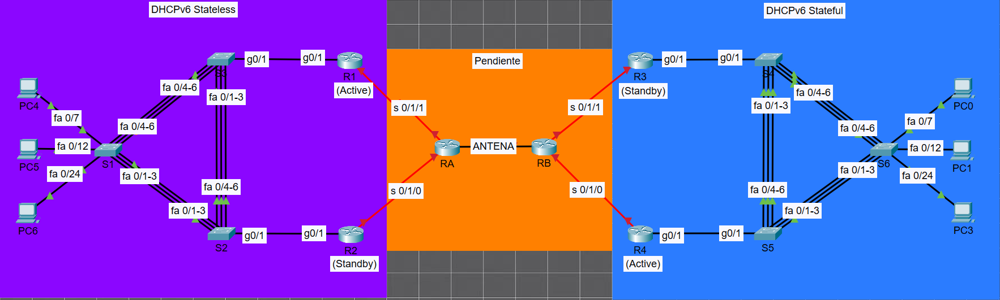

# Proyecto Integrador del 5° Semestre Grupo B - Ingeniería en TIC's, ITSOEH

## **Datos del Equipo**  
**Institución**: Instituto Tecnológico Superior del Occidente del Estado de Hidalgo.  
**Programa Educativo**: Ingeniería en Tecnologías de la Información y Comunicaciones.  
**Semestre y Grupo**: 5° "B".  
**Asignatura**: Redes de Computadoras.  

**Integrantes**:  
- [230110322]  Cruz Martínez Alejandro
- [230110032]  Chávez Atanacio Yael Antonio
- [230110528]  Gonzaga López Luis Fernando 
- [230110578]  Martínez Hernández Brayan 
- [230110358]  Soto Hernandez Edwin Salvador 

<details> 
    <summary>
        Topología Física 
    </summary>

</details>

<details> 
    <summary>
        Topología Lógica 
    </summary>

</details>

<details> 
    <summary>
        Extras
    </summary>

Borrar la configuración guardada en NVRAM.

```ini
Switch# erase startup-config
```

Configuraciones rápiadas:
- [Stateless](assets/txt/stateless.md)
- [Stateful](assets/txt/stateful.md)

</details>

---

## DHCP Stateless
<details> 
    <summary>
        Configuraciones Switch S1
    </summary>

```ini
S1# sdm prefer dual-ipv4-and-ipv6 default
S1# reload
System configuration has been modified. Save? [yes/no]:yes
@@@@@@@@@@@@@@@@@@@@@@@@@@@@@@@@@@@@@@@@@@@@@@@@@@@@@@@@@@@@@@@@@@@@@@@@@@@@@@@@@@@@@@@@@@@@@

S1> enable
S1# configure terminal

S1(config)# line console 0
S1(config-line)# logging synchronous
S1(config-line)# exit

S1(config)# hostname S1
S1(config)# enable password cisco
S1(config)# enable secret tics
S1(config)# banner motd # Solo acceso autorizado S1 #
S1(config)# service password-encryption

S1(config)# vlan 15
S1(config-vlan)# name Estudiantes
S1(config-vlan)# exit
S1(config)# vlan 45
S1(config-vlan)# name Docentes
S1(config-vlan)# exit
S1(config)# vlan 55
S1(config-vlan)# name Admin
S1(config-vlan)# exit
S1(config)# vlan 65
S1(config-vlan)# name Native
S1(config-vlan)# exit

S1(config)# interface vlan 55
S1(config-if)# no ip address
S1(config-if)# ipv6 address 2001:db8:cafe:55::1/64
S1(config-if)# no shutdown
S1(config-if)# exit

S1(config)# interface range f 0/1-24
S1(config-if-range)# switchport mode access
S1(config-if-range)# switchport access vlan 65
S1(config-if-range)# shutdown
S1(config-if-range)# exit

S1(config)# interface range g 0/1-2
S1(config-if-range)# switchport mode access
S1(config-if-range)# switchport access vlan 65
S1(config-if-range)# exit

S1(config)# interface range f 0/7,f 0/8
S1(config-if-range)# switchport mode access
S1(config-if-range)# switchport access vlan 15
S1(config-if-range)# switchport port-security
S1(config-if-range)# switchport port-security maximum 2
S1(config-if-range)# switchport port-security mac-address sticky
S1(config-if-range)# switchport port-security violation shutdown
S1(config-if-range)# no shutdown
S1(config-if-range)# exit

S1(config)# interface range f 0/9,f 0/12
S1(config-if-range)# switchport mode access
S1(config-if-range)# switchport access vlan 45
S1(config-if-range)# switchport port-security
S1(config-if-range)# switchport port-security maximum 2
S1(config-if-range)# switchport port-security mac-address sticky
S1(config-if-range)# switchport port-security violation shutdown
S1(config-if-range)# no shutdown
S1(config-if-range)# exit

S1(config)# interface f 0/24
S1(config-if)# switchport mode access
S1(config-if)# switchport access vlan 65
S1(config-if)# switchport port-security
S1(config-if)# switchport port-security maximum 2
S1(config-if)# switchport port-security mac-address sticky
S1(config-if)# switchport port-security violation shutdown
S1(config-if)# no shutdown
S1(config-if)# exit

S1(config)# interface range f 0/1-3
S1(config-if-range)# channel-group 1 mode on
S1(config-if-range)# no shutdown
S1(config-if-range)# exit
S1(config)# interface port-channel 1
S1(config-if)# switchport mode trunk
S1(config-if)# switchport trunk allowed vlan 15,45,55,65
S1(config-if)# switchport trunk native vlan 65
S1(config-if)# no shutdown
S1(config-if)# exit

S1(config)# interface range f 0/4-6
S1(config-if-range)# channel-group 2 mode desirable
S1(config-if-range)# no shutdown
S1(config-if-range)# exit
S1(config)# interface port-channel 2
S1(config-if)# switchport mode trunk
S1(config-if)# switchport trunk allowed vlan 15,45,55,65
S1(config-if)# switchport trunk native vlan 65
S1(config-if)# no shutdown
S1(config-if)# exit

S1(config)# username admin password admin
S1(config)# ip domain-name itsoeh.edu
S1(config)# crypto key generate rsa
How many bits in the modulus [512]:
    1024
S1(config)# line vty 0 15
S1(config-line)# transport input ssh
S1(config-line)# login local
S1(config-line)# exit
```

</details>

<details> 
    <summary>
        Configuraciones Switch S2
    </summary>

```ini
S2# sdm prefer dual-ipv4-and-ipv6 default
S2# reload
System configuration has been modified. Save? [yes/no]:yes
@@@@@@@@@@@@@@@@@@@@@@@@@@@@@@@@@@@@@@@@@@@@@@@@@@@@@@@@@@@@@@@@@@@@@@@@@@@@@@@@@@@@@@@@@@@@@

S2> enable
S2# configure terminal

S2(config)# line console 0
S2(config-line)# logging synchronous
S2(config-line)# exit

S2(config)# hostname S2
S2(config)# enable password cisco
S2(config)# enable secret tics
S2(config)# banner motd # Solo acceso autorizado S2 #
S2(config)# service password-encryption

S2(config)# vlan 15
S2(config-vlan)# name Estudiantes
S2(config-vlan)# exit
S2(config)# vlan 45
S2(config-vlan)# name Docentes
S2(config-vlan)# exit
S2(config)# vlan 55
S2(config-vlan)# name Admin
S2(config-vlan)# exit
S2(config)# vlan 65
S2(config-vlan)# name Native
S2(config-vlan)# exit

S2(config)# interface vlan 55
S2(config-if)# no ip address
S2(config-if)# ipv6 enable
S2(config-if)# ipv6 address 2001:db8:cafe:55::2/64
S2(config-if)# no shutdown
S2(config-if)# exit

S2(config)# interface range f 0/1-24
S2(config-if-range)# switchport mode access
S2(config-if-range)# switchport access vlan 65
S2(config-if-range)# shutdown
S2(config-if-range)# exit

S2(config)# interface range g 0/1-2
S2(config-if-range)# switchport mode access
S2(config-if-range)# switchport access vlan 65
S2(config-if-range)# exit

S2(config)# interface range f 0/7,f 0/8
S2(config-if-range)# switchport mode access
S2(config-if-range)# switchport access vlan 15
S2(config-if-range)# switchport port-security
S2(config-if-range)# switchport port-security maximum 2
S2(config-if-range)# switchport port-security mac-address sticky
S2(config-if-range)# switchport port-security violation shutdown
S2(config-if-range)# no shutdown
S2(config-if-range)# exit

S2(config)# interface range f 0/9,f 0/12
S2(config-if-range)# switchport mode access
S2(config-if-range)# switchport access vlan 45
S2(config-if-range)# switchport port-security
S2(config-if-range)# switchport port-security maximum 2
S2(config-if-range)# switchport port-security mac-address sticky
S2(config-if-range)# switchport port-security violation shutdown
S2(config-if-range)# no shutdown
S2(config-if-range)# exit

S2(config)# interface f 0/24
S2(config-if)# switchport mode access
S2(config-if)# switchport access vlan 65
S2(config-if)# switchport port-security
S2(config-if)# switchport port-security maximum 2
S2(config-if)# switchport port-security mac-address sticky
S2(config-if)# switchport port-security violation shutdown
S2(config-if)# no shutdown
S2(config-if)# exit

S2(config)# interface range f 0/1-3
S2(config-if-range)# channel-group 1 mode passive
S2(config-if-range)# no shutdown
S2(config-if-range)# exit
S2(config)# interface port-channel 1
S2(config-if)# switchport mode trunk
S2(config-if)# switchport trunk allowed vlan 15,45,55,65
S2(config-if)# switchport trunk native vlan 65
S2(config-if)# no shutdown
S2(config-if)# exit

S2(config)# interface range f 0/4-6
S2(config-if-range)# channel-group 2 mode on
S2(config-if-range)# no shutdown
S2(config-if-range)# exit
S2(config)# interface port-channel 2
S2(config-if)# switchport mode trunk
S2(config-if)# switchport trunk allowed vlan 15,45,55,65
S2(config-if)# switchport trunk native vlan 65
S2(config-if)# no shutdown
S2(config-if)# exit

S2(config)# interface g 0/1
S2(config-if)# switchport mode trunk
S2(config-if)# switchport trunk allowed vlan 15,45,55,65
S2(config-if)# switchport trunk native vlan 65
S2(config-if)# no shutdown
S2(config-if)# exit

S2(config)# username admin password admin
S2(config)# ip domain-name itsoeh.edu
S2(config)# crypto key generate rsa
How many bits in the modulus [512]:
    1024
S2(config)# line vty 0 15
S2(config-line)# transport input ssh
S2(config-line)# login local
S2(config-line)# exit
```

</details>

<details> 
    <summary>
        Configuraciones Switch S3
    </summary>

```ini
S3# sdm prefer dual-ipv4-and-ipv6 default
S3# reload
System configuration has been modified. Save? [yes/no]:yes
@@@@@@@@@@@@@@@@@@@@@@@@@@@@@@@@@@@@@@@@@@@@@@@@@@@@@@@@@@@@@@@@@@@@@@@@@@@@@@@@@@@@@@@@@@@@@

S3> enable
S3# configure terminal

S3(config)# line console 0
S3(config-line)# logging synchronous
S3(config-line)# exit

S3(config)# hostname S3
S3(config)# enable password cisco
S3(config)# enable secret tics
S3(config)# banner motd # Solo acceso autorizado S3 #
S3(config)# service password-encryption

S3(config)# vlan 15
S3(config-vlan)# name Estudiantes
S3(config-vlan)# exit
S3(config)# vlan 45
S3(config-vlan)# name Docentes
S3(config-vlan)# exit
S3(config)# vlan 55
S3(config-vlan)# name Admin
S3(config-vlan)# exit
S3(config)# vlan 65
S3(config-vlan)# name Native
S3(config-vlan)# exit

S3(config)# interface vlan 55
S3(config-if)# no ip address
S3(config-if)# ipv6 enable
S3(config-if)# ipv6 address 2001:db8:cafe:55::3/64
S3(config-if)# no shutdown
S3(config-if)# exit

S3(config)# interface range f 0/1-24
S3(config-if-range)# switchport mode access
S3(config-if-range)# switchport access vlan 65
S3(config-if-range)# shutdown
S3(config-if-range)# exit
S3(config)# interface range g 0/1-2
S3(config-if-range)# switchport mode access
S3(config-if-range)# switchport access vlan 65
S3(config-if-range)# exit

S3(config)# interface range f 0/7,f 0/8
S3(config-if-range)# switchport mode access
S3(config-if-range)# switchport access vlan 15
S3(config-if-range)# switchport port-security
S3(config-if-range)# switchport port-security maximum 2
S3(config-if-range)# switchport port-security mac-address sticky
S3(config-if-range)# switchport port-security violation shutdown
S3(config-if-range)# no shutdown
S3(config-if-range)# exit

S3(config)# interface range f 0/9,f 0/12
S3(config-if-range)# switchport mode access
S3(config-if-range)# switchport access vlan 45
S3(config-if-range)# switchport port-security
S3(config-if-range)# switchport port-security maximum 2
S3(config-if-range)# switchport port-security mac-address sticky
S3(config-if-range)# switchport port-security violation shutdown
S3(config-if-range)# no shutdown
S3(config-if-range)# exit

S3(config)# interface f 0/24
S3(config-if)# switchport mode access
S3(config-if)# switchport access vlan 65
S3(config-if)# switchport port-security
S3(config-if)# switchport port-security maximum 2
S3(config-if)# switchport port-security mac-address sticky
S3(config-if)# switchport port-security violation shutdown
S3(config-if)# no shutdown
S3(config-if)# exit

S3(config)# interface range f 0/1-3
S3(config-if-range)# channel-group 1 mode on
S3(config-if-range)# no shutdown
S3(config-if-range)# exit
S3(config)# interface port-channel 1
S3(config-if)# switchport mode trunk
S3(config-if)# switchport trunk allowed vlan 15,45,55,65
S3(config-if)# switchport trunk native vlan 65
S3(config-if)# no shutdown
S3(config-if)# exit

S3(config)# interface range f 0/4-6
S3(config-if-range)# channel-group 2 mode desirable
S3(config-if-range)# no shutdown
S3(config-if-range)# exit
S3(config)# interface port-channel 2
S3(config-if)# switchport mode trunk
S3(config-if)# switchport trunk allowed vlan 15,45,55,65
S3(config-if)# switchport trunk native vlan 65
S3(config-if)# no shutdown
S3(config-if)# exit

S3(config)# interface g0/1
S3(config-if)# switchport mode trunk
S3(config-if)# switchport trunk allowed vlan 15,45,55,65
S3(config-if)# switchport trunk native vlan 65
S3(config-if)# no shutdown
S3(config-if)# exit

S3(config)# username admin password admin
S3(config)# ip domain-name itsoeh.edu
S3(config)# crypto key generate rsa
How many bits in the modulus [512]:
    1024
S3(config)# line vty 0 15
S3(config-line)# transport input ssh
S3(config-line)# login local
S3(config-line)# exit
```

</details>

<details> 
    <summary>
        Configuraciones Router R1
    </summary>

```ini
R1> enable
R1# configure terminal

R1(config)# line console 0
R1(config-line)# logging synchronous
R1(config-line)# exit

R1(config)# hostname R1
R1(config)# enable password cisco
R1(config)# enable secret tics
R1(config)# banner motd # Solo acceso autorizado R1 #
R1(config)# service password-encryption

R1(config)# interface g 0/1
R1(config-if)# no shutdown
R1(config-if)# exit

R1(config)# ipv6 unicast-routing
R1(config)# ipv6 dhcp pool DHCP-STATELESS-15
R1(config-dhcp)# domain-name tics.edu.mx
R1(config-dhcp)# exit
R1(config)# ipv6 dhcp pool DHCP-STATELESS-45
R1(config-dhcp)# domain-name tics.edu.mx
R1(config-dhcp)# exit
R1(config)# ipv6 dhcp pool DHCP-STATELESS-55
R1(config-dhcp)# domain-name tics.edu.mx
R1(config-dhcp)# exit
R1(config)# ipv6 dhcp pool DHCP-STATELESS-65
R1(config-dhcp)# domain-name tics.edu.mx
R1(config-dhcp)# exit

R1(config)# interface g 0/1.15
R1(config-if)# encapsulation dot1Q 15
R1(config-if)# no ip address
R1(config-if)# ipv6 address 2001:db8:cafe:15::/64 eui-64
R1(config-if)# ipv6 enable
R1(config-if)# ipv6 nd other-config-flag
R1(config-if)# ipv6 dhcp server DHCP-STATELESS-15
R1(config-if)# no shutdown
R1(config-if)# standby version 2
R1(config-if)# standby 15 ipv6 autoconfig
R1(config-if)# standby 15 priority 150
R1(config-if)# standby 15 preempt
R1(config-if)# exit
R1(config)# interface g 0/1.45
R1(config-if)# encapsulation dot1Q 45
R1(config-if)# no ip address
R1(config-if)# ipv6 address 2001:db8:cafe:45::/64 eui-64
R1(config-if)# ipv6 enable
R1(config-if)# ipv6 nd other-config-flag
R1(config-if)# ipv6 dhcp server DHCP-STATELESS-45
R1(config-if)# no shutdown
R1(config-if)# standby version 2
R1(config-if)# standby 45 priority 150
R1(config-if)# standby 45 preempt
R1(config-if)# standby 45 ipv6 autoconfig
R1(config-if)# exit
R1(config)# interface g 0/1.55
R1(config-if)# encapsulation dot1Q 55
R1(config-if)# no ip address
R1(config-if)# ipv6 address 2001:db8:cafe:55::/64 eui-64
R1(config-if)# ipv6 enable
R1(config-if)# ipv6 nd other-config-flag
R1(config-if)# ipv6 dhcp server DHCP-STATELESS-55
R1(config-if)# no shutdown
R1(config-if)# standby version 2
R1(config-if)# standby 55 ipv6 autoconfig
R1(config-if)# standby 55 priority 150
R1(config-if)# standby 55 preempt
R1(config-if)# exit
R1(config)# interface g 0/1.65
R1(config-if)# encapsulation dot1Q 65 native
R1(config-if)# no ip address
R1(config-if)# ipv6 address 2001:db8:cafe:65::/64 eui-64
R1(config-if)# ipv6 enable
R1(config-if)# ipv6 nd other-config-flag
R1(config-if)# ipv6 dhcp server DHCP-STATELESS-65
R1(config-if)# no shutdown
R1(config-if)# standby version 2
R1(config-if)# standby 65 ipv6 autoconfig
R1(config-if)# standby 65 priority 150
R1(config-if)# standby 65 preempt
R1(config-if)# exit

R1(config)# username admin password admin
R1(config)# ip domain-name itsoeh.edu
R1(config)# crypto key generate rsa
How many bits in the modulus [512]:
    1024
R1(config)# line vty 0 15
R1(config-line)# transport input ssh
R1(config-line)# login local
R1(config-line)# exit
```

</details>

<details> 
    <summary>
        Configuraciones Router R2
    </summary>

```ini
R2> enable
R2# configure terminal

R2(config)# line console 0
R2(config-line)# logging synchronous
R2(config-line)# exit

R2(config)# hostname R2
R2(config)# enable password cisco
R2(config)# enable secret tics
R2(config)# banner motd # Solo acceso autorizado R2 #
R2(config)# service password-encryption

R2(config)# interface g 0/1
R2(config-if)# no shutdown
R2(config-if)# exit

R2(config)# ipv6 unicast-routing
R2(config)# ipv6 dhcp pool DHCP-STATELESS-15
R2(config-dhcp)# domain-name tics.edu.mx
R2(config-dhcp)# exit
R2(config)# ipv6 dhcp pool DHCP-STATELESS-45
R2(config-dhcp)# domain-name tics.edu.mx
R2(config-dhcp)# exit
R2(config)# ipv6 dhcp pool DHCP-STATELESS-55
R2(config-dhcp)# domain-name tics.edu.mx
R2(config-dhcp)# exit
R2(config)# ipv6 dhcp pool DHCP-STATELESS-65
R2(config-dhcp)# domain-name tics.edu.mx
R2(config-dhcp)# exit

R2(config)# interface g 0/1.15
R2(config-if)# encapsulation dot1Q 15
R2(config-if)# no ip address
R2(config-if)# ipv6 address 2001:db8:cafe:15::/64 eui-64
R2(config-if)# ipv6 enable
R2(config-if)# ipv6 nd other-config-flag
R2(config-if)# ipv6 dhcp server DHCP-STATELESS-15
R2(config-if)# no shutdown
R2(config-if)# standby version 2
R2(config-if)# standby 15 ipv6 autoconfig
R2(config-if)# standby 15 priority 100
R2(config-if)# exit
R2(config)# interface g 0/1.45
R2(config-if)# encapsulation dot1Q 45
R2(config-if)# no ip address
R2(config-if)# ipv6 address 2001:db8:cafe:45::/64 eui-64
R2(config-if)# ipv6 enable
R2(config-if)# ipv6 nd other-config-flag
R2(config-if)# ipv6 dhcp server DHCP-STATELESS-45
R2(config-if)# no shutdown
R2(config-if)# standby version 2
R2(config-if)# standby 45 ipv6 autoconfig
R2(config-if)# standby 45 priority 100
R2(config-if)# exit
R2(config)# interface g 0/1.55
R2(config-if)# encapsulation dot1Q 55
R2(config-if)# no ip address
R2(config-if)# ipv6 address 2001:db8:cafe:55::/64 eui-64
R2(config-if)# ipv6 enable
R2(config-if)# ipv6 nd other-config-flag
R2(config-if)# ipv6 dhcp server DHCP-STATELESS-55
R2(config-if)# no shutdown
R2(config-if)# standby version 2
R2(config-if)# standby 55 ipv6 autoconfig
R2(config-if)# standby 55 priority 100
R2(config-if)# exit
R2(config)# interface g 0/1.65
R2(config-if)# encapsulation dot1Q 65 native
R2(config-if)# no ip address
R2(config-if)# ipv6 address 2001:db8:cafe:65::/64 eui-64
R2(config-if)# ipv6 enable
R2(config-if)# ipv6 nd other-config-flag
R2(config-if)# ipv6 dhcp server DHCP-STATELESS-65
R2(config-if)# no shutdown
R2(config-if)# standby version 2
R2(config-if)# standby 65 priority 100
R2(config-if)# standby 65 ipv6 autoconfig
R2(config-if)# exit

R2(config)# username admin password admin
R2(config)# ip domain-name itsoeh.edu
R2(config)# crypto key generate rsa
How many bits in the modulus [512]:
    1024
R2(config)# line vty 0 15
R2(config-line)# transport input ssh
R2(config-line)# login local
R2(config-line)# exit
```

</details>

<details> 
    <summary>
        Configuraciones Router RA
    </summary>

```diff
- Pendiente
```

</details>

---

## DHCP Stateful
<details> 
    <summary>
        Configuraciones Switch S4
    </summary>

```ini
S4# sdm prefer dual-ipv4-and-ipv6 default
S4# reload
System configuration has been modified. Save? [yes/no]:yes
@@@@@@@@@@@@@@@@@@@@@@@@@@@@@@@@@@@@@@@@@@@@@@@@@@@@@@@@@@@@@@@@@@@@@@@@@@@@@@@@@@@@@@@@@@@@@

S4> enable
S4# configure terminal

S4(config)# line console 0
S4(config-line)# logging synchronous
S4(config-line)# exit

S4(config)# hostname S4
S4(config)# enable password cisco
S4(config)# enable secret tics
S4(config)# banner motd # Solo acceso autorizado S4 #
S4(config)# service password-encryption

S4(config)# vlan 10
S4(config-vlan)# name Estudiantes
S4(config-vlan)# exit
S4(config)# vlan 20
S4(config-vlan)# name Docentes
S4(config-vlan)# exit
S4(config)# vlan 30
S4(config-vlan)# name Admin
S4(config-vlan)# exit
S4(config)# vlan 40
S4(config-vlan)# name Native
S4(config-vlan)# exit

S4(config)# interface vlan 30
S4(config-if)# no ip address
S4(config-if)# ipv6 address 2001:db8:3c4d:30::4/64
S4(config-if)# no shutdown
S4(config-if)# exit

S4(config)# interface range f 0/1-24
S4(config-if-range)# switchport mode access
S4(config-if-range)# switchport access vlan 40
S4(config-if-range)# shutdown
S4(config-if-range)# exit

S4(config)# interface range g 0/1-2
S4(config-if-range)# switchport mode access
S4(config-if-range)# switchport access vlan 40
S4(config-if-range)# exit

S4(config)# interface range f 0/7,f 0/8
S4(config-if-range)# switchport mode access
S4(config-if-range)# switchport access vlan 10
S4(config-if-range)# switchport port-security
S4(config-if-range)# switchport port-security maximum 2
S4(config-if-range)# switchport port-security mac-address sticky
S4(config-if-range)# switchport port-security violation shutdown
S4(config-if-range)# no shutdown
S4(config-if-range)# exit

S4(config)# interface range f 0/9,f 0/12
S4(config-if-range)# switchport mode access
S4(config-if-range)# switchport access vlan 20
S4(config-if-range)# switchport port-security
S4(config-if-range)# switchport port-security maximum 2
S4(config-if-range)# switchport port-security mac-address sticky
S4(config-if-range)# switchport port-security violation shutdown
S4(config-if-range)# no shutdown
S4(config-if-range)# exit

S4(config)# interface f 0/24
S4(config-if)# switchport mode access
S4(config-if)# switchport access vlan 40
S4(config-if)# switchport port-security
S4(config-if)# switchport port-security maximum 2
S4(config-if)# switchport port-security mac-address sticky
S4(config-if)# switchport port-security violation shutdown
S4(config-if)# no shutdown
S4(config-if)# exit

S4(config)# interface range f 0/1-3
S4(config-if-range)# channel-group 1 mode on
S4(config-if-range)# no shutdown
S4(config-if-range)# exit
S4(config)# interface port-channel 1
S4(config-if)# switchport mode trunk
S4(config-if)# switchport trunk allowed vlan 10,20,30,40
S4(config-if)# switchport trunk native vlan 40
S4(config-if)# no shutdown
S4(config-if)# exit

S4(config)# interface range f 0/4-6
S4(config-if-range)# channel-group 2 mode desirable
S4(config-if-range)# no shutdown
S4(config-if-range)# exit
S4(config)# interface port-channel 2
S4(config-if)# switchport mode trunk
S4(config-if)# switchport trunk allowed vlan 10,20,30,40
S4(config-if)# switchport trunk native vlan 40
S4(config-if)# no shutdown
S4(config-if)# exit

S4(config)# interface g 0/1
S4(config-if)# switchport mode trunk
S4(config-if)# switchport trunk allowed vlan 10,20,30,40
S4(config-if)# switchport trunk native vlan 40
S4(config-if)# no shutdown
S4(config-if)# exit

S4(config)# username admin password admin
S4(config)# ip domain-name itsoeh.edu
S4(config)# crypto key generate rsa
How many bits in the modulus [512]:
    1024
S4(config)# line vty 0 15
S4(config-line)# transport input ssh
S4(config-line)# login local
S4(config-line)# exit
```

</details>

<details> 
    <summary>
        Configuraciones Switch S5
    </summary>

```ini
S5# sdm prefer dual-ipv4-and-ipv6 default
S5# reload
System configuration has been modified. Save? [yes/no]:yes
@@@@@@@@@@@@@@@@@@@@@@@@@@@@@@@@@@@@@@@@@@@@@@@@@@@@@@@@@@@@@@@@@@@@@@@@@@@@@@@@@@@@@@@@@@@@@

S5> enable
S5# configure terminal

S5(config)# line console 0
S5(config-line)# logging synchronous
S5(config-line)# exit

S5(config)# hostname S5
S5(config)# enable password cisco
S5(config)# enable secret tics
S5(config)# banner motd # Solo acceso autorizado S5 #
S5(config)# service password-encryption

S5(config)# vlan 10
S5(config-vlan)# name Estudiantes
S5(config-vlan)# exit
S5(config)# vlan 20
S5(config-vlan)# name Docentes
S5(config-vlan)# exit
S5(config)# vlan 30
S5(config-vlan)# name Admin
S5(config-vlan)# exit
S5(config)# vlan 40
S5(config-vlan)# name Native
S5(config-vlan)# exit

S5(config)# interface vlan 30
S5(config-if)# no ip address
S5(config-if)# ipv6 enable
S5(config-if)# ipv6 address 2001:db8:3c4d:30::5/64
S5(config-if)# no shutdown
S5(config-if)# exit

S5(config)# interface range f 0/1-24
S5(config-if-range)# switchport mode access
S5(config-if-range)# switchport access vlan 40
S5(config-if-range)# shutdown
S5(config-if-range)# exit

S5(config)# interface range g 0/1-2
S5(config-if-range)# switchport mode access
S5(config-if-range)# switchport access vlan 40
S5(config-if-range)# exit

S5(config)# interface range f 0/7,f 0/8
S5(config-if-range)# switchport mode access
S5(config-if-range)# switchport access vlan 10
S5(config-if-range)# switchport port-security
S5(config-if-range)# switchport port-security maximum 2
S5(config-if-range)# switchport port-security mac-address sticky
S5(config-if-range)# switchport port-security violation shutdown
S5(config-if-range)# no shutdown
S5(config-if-range)# exit

S5(config)# interface range f 0/9,f 0/12
S5(config-if-range)# switchport mode access
S5(config-if-range)# switchport access vlan 20
S5(config-if-range)# switchport port-security
S5(config-if-range)# switchport port-security maximum 2
S5(config-if-range)# switchport port-security mac-address sticky
S5(config-if-range)# switchport port-security violation shutdown
S5(config-if-range)# no shutdown
S5(config-if-range)# exit

S5(config)# interface f 0/24
S5(config-if)# switchport mode access
S5(config-if)# switchport access vlan 40
S5(config-if)# switchport port-security
S5(config-if)# switchport port-security maximum 2
S5(config-if)# switchport port-security mac-address sticky
S5(config-if)# switchport port-security violation shutdown
S5(config-if)# no shutdown
S5(config-if)# exit

S5(config)# interface range f 0/1-3
S5(config-if-range)# channel-group 1 mode passive
S5(config-if-range)# no shutdown
S5(config-if-range)# exit
S5(config)# interface port-channel 1
S5(config-if)# switchport mode trunk
S5(config-if)# switchport trunk allowed vlan 10,20,30,40
S5(config-if)# switchport trunk native vlan 40
S5(config-if)# no shutdown
S5(config-if)# exit

S5(config)# interface range f 0/4-6
S5(config-if-range)# channel-group 2 mode on
S5(config-if-range)# no shutdown
S5(config-if-range)# exit
S5(config)# interface port-channel 2
S5(config-if)# switchport mode trunk
S5(config-if)# switchport trunk allowed vlan 10,20,30,40
S5(config-if)# switchport trunk native vlan 40
S5(config-if)# no shutdown
S5(config-if)# exit

S5(config)# interface g 0/1
S5(config-if)# switchport mode trunk
S5(config-if)# switchport trunk allowed vlan 10,20,30,40
S5(config-if)# switchport trunk native vlan 40
S5(config-if)# no shutdown
S5(config-if)# exit

S5(config)# username admin password admin
S5(config)# ip domain-name itsoeh.edu
S5(config)# crypto key generate rsa
How many bits in the modulus [512]:
    1024
S5(config)# line vty 0 15
S5(config-line)# transport input ssh
S5(config-line)# login local
S5(config-line)# exit
```

</details>

<details> 
    <summary>
        Configuraciones Switch S6
    </summary>

```ini
S6# sdm prefer dual-ipv4-and-ipv6 default
S6# reload
System configuration has been modified. Save? [yes/no]:yes
@@@@@@@@@@@@@@@@@@@@@@@@@@@@@@@@@@@@@@@@@@@@@@@@@@@@@@@@@@@@@@@@@@@@@@@@@@@@@@@@@@@@@@@@@@@@@

S6> enable
S6# configure terminal

S6(config)# line console 0
S6(config-line)# logging synchronous
S6(config-line)# exit

S6(config)# hostname S6
S6(config)# enable password cisco
S6(config)# enable secret tics
S6(config)# banner motd # Solo acceso autorizado S6 #
S6(config)# service password-encryption

S6(config)# vlan 10
S6(config-vlan)# name Estudiantes
S6(config-vlan)# exit
S6(config)# vlan 20
S6(config-vlan)# name Docentes
S6(config-vlan)# exit
S6(config)# vlan 30
S6(config-vlan)# name Admin
S6(config-vlan)# exit
S6(config)# vlan 40
S6(config-vlan)# name Native
S6(config-vlan)# exit

S6(config)# interface vlan 30
S6(config-if)# no ip address
S6(config-if)# ipv6 enable
S6(config-if)# ipv6 address 2001:db8:3c4d:30::6/64
S6(config-if)# no shutdown
S6(config-if)# exit

S6(config)# interface range f 0/1-24
S6(config-if-range)# switchport mode access
S6(config-if-range)# switchport access vlan 40
S6(config-if-range)# shutdown
S6(config-if-range)# exit

S6(config)# interface range g 0/1-2
S6(config-if-range)# switchport mode access
S6(config-if-range)# switchport access vlan 40
S6(config-if-range)# exit

S6(config)# interface range f 0/7,f 0/8
S6(config-if-range)# switchport mode access
S6(config-if-range)# switchport access vlan 10
S6(config-if-range)# switchport port-security
S6(config-if-range)# switchport port-security maximum 2
S6(config-if-range)# switchport port-security mac-address sticky
S6(config-if-range)# switchport port-security violation shutdown
S6(config-if-range)# no shutdown
S6(config-if-range)# exit

S6(config)# interface range f 0/9,f 0/12
S6(config-if-range)# switchport mode access
S6(config-if-range)# switchport access vlan 20
S6(config-if-range)# switchport port-security
S6(config-if-range)# switchport port-security maximum 2
S6(config-if-range)# switchport port-security mac-address sticky
S6(config-if-range)# switchport port-security violation shutdown
S6(config-if-range)# no shutdown
S6(config-if-range)# exit

S6(config)# interface f 0/24
S6(config-if)# switchport mode access
S6(config-if)# switchport access vlan 40
S6(config-if)# switchport port-security
S6(config-if)# switchport port-security maximum 2
S6(config-if)# switchport port-security mac-address sticky
S6(config-if)# switchport port-security violation shutdown
S6(config-if)# no shutdown
S6(config-if)# exit

S6(config)# interface range f 0/1-3
S6(config-if-range)# channel-group 1 mode on
S6(config-if-range)# no shutdown
S6(config-if-range)# exit
S6(config)# interface port-channel 1
S6(config-if)# switchport mode trunk
S6(config-if)# switchport trunk allowed vlan 10,20,30,40
S6(config-if)# switchport trunk native vlan 40
S6(config-if)# no shutdown
S6(config-if)# exit

S6(config)# interface range f 0/4-6
S6(config-if-range)# channel-group 2 mode desirable
S6(config-if-range)# no shutdown
S6(config-if-range)# exit
S6(config)# interface port-channel 2
S6(config-if)# switchport mode trunk
S6(config-if)# switchport trunk allowed vlan 10,20,30,40
S6(config-if)# switchport trunk native vlan 40
S6(config-if)# no shutdown
S6(config-if)# exit

S6(config)# interface g 0/1
S6(config-if)# switchport mode trunk
S6(config-if)# switchport trunk allowed vlan 10,20,30,40
S6(config-if)# switchport trunk native vlan 40
S6(config-if)# no shutdown
S6(config-if)# exit

S6(config)# username admin password admin
S6(config)# ip domain-name itsoeh.edu
S6(config)# crypto key generate rsa
How many bits in the modulus [512]:
    1024
S6(config)# line vty 0 15
S6(config-line)# transport input ssh
S6(config-line)# login local
S6(config-line)# exit
```

</details>

<details> 
    <summary>
        Configuraciones Router R3
    </summary>

```ini
R3> enable
R3# configure terminal

R3(config)# line console 0
R3(config-line)# logging synchronous
R3(config-line)# exit

R3(config)# hostname R3
R3(config)# enable password cisco
R3(config)# enable secret tics
R3(config)# banner motd # Solo acceso autorizado R3 #
R3(config)# service password-encryption

R3(config)# interface g 0/1
R3(config-if)# no shutdown
R3(config-if)# exit

R3(config)# ipv6 unicast-routing
R3(config)# ipv6 dhcp pool DHCP-STATEFUL-10
R3(config-dhcp)# address prefix 2001:db8:3c4d:10::/64
R3(config-dhcp)# domain-name tics.edu.mx
R3(config-dhcp)# dns-server 2001:db8:3c4d:30::1
R3(config-dhcp)# exit
R3(config)# ipv6 dhcp pool DHCP-STATEFUL-20
R3(config-dhcp)# address prefix 2001:db8:3c4d:20::/64
R3(config-dhcp)# domain-name tics.edu.mx
R3(config-dhcp)# dns-server 2001:db8:3c4d:30::1
R3(config-dhcp)# exit
R3(config)# ipv6 dhcp pool DHCP-STATEFUL-30
R3(config-dhcp)# address prefix 2001:db8:3c4d:30::/64
R3(config-dhcp)# domain-name tics.edu.mx
R3(config-dhcp)# dns-server 2001:db8:3c4d:30::1
R3(config-dhcp)# exit
R3(config)# ipv6 dhcp pool DHCP-STATEFUL-40
R3(config-dhcp)# address prefix 2001:db8:3c4d:40::/64
R3(config-dhcp)# domain-name tics.edu.mx
R3(config-dhcp)# dns-server 2001:db8:3c4d:30::1
R3(config-dhcp)# exit

R3(config)# interface g 0/1.10
R3(config-if)# encapsulation dot1Q 10
R3(config-if)# no ip address
R3(config-if)# ipv6 address 2001:db8:3c4d:10::1/64
R3(config-if)# ipv6 enable
R3(config-if)# ipv6 dhcp server DHCP-STATEFUL-10
R3(config-if)# no shutdown
R3(config-if)# standby version 2
R3(config-if)# standby 10 ipv6 autoconfig
R3(config-if)# standby 10 priority 150
R3(config-if)# standby 10 preempt
R3(config-if)# exit
R3(config)# interface g 0/1.20
R3(config-if)# encapsulation dot1Q 20
R3(config-if)# no ip address
R3(config-if)# ipv6 address 2001:db8:3c4d:20::1/64
R3(config-if)# ipv6 enable
R3(config-if)# ipv6 dhcp server DHCP-STATEFUL-20
R3(config-if)# no shutdown
R3(config-if)# standby version 2
R3(config-if)# standby 20 ipv6 autoconfig
R3(config-if)# standby 20 priority 150
R3(config-if)# standby 20 preempt
R3(config-if)# exit
R3(config)# interface g 0/1.30
R3(config-if)# encapsulation dot1Q 30
R3(config-if)# no ip address
R3(config-if)# ipv6 address 2001:db8:3c4d:30::1/64
R3(config-if)# ipv6 enable
R3(config-if)# ipv6 dhcp server DHCP-STATEFUL-30
R3(config-if)# no shutdown
R3(config-if)# standby version 2
R3(config-if)# standby 30 ipv6 autoconfig
R3(config-if)# standby 30 priority 150
R3(config-if)# standby 30 preempt
R3(config-if)# exit
R3(config)# interface g 0/1.40
R3(config-if)# encapsulation dot1Q 40 native
R3(config-if)# no ip address
R3(config-if)# ipv6 address 2001:db8:3c4d:40::1/64
R3(config-if)# ipv6 enable
R3(config-if)# ipv6 dhcp server DHCP-STATEFUL-40
R3(config-if)# no shutdown
R3(config-if)# standby version 2
R3(config-if)# standby 40 ipv6 autoconfig
R3(config-if)# standby 40 priority 150
R3(config-if)# standby 40 preempt
R3(config-if)# exit

R3(config)# username admin password admin
R3(config)# ip domain-name itsoeh.edu
R3(config)# crypto key generate rsa
How many bits in the modulus [512]:
    1024
R3(config)# line vty 0 15
R3(config-line)# transport input ssh
R3(config-line)# login local
R3(config-line)# exit
```

</details>

<details> 
    <summary>
        Configuraciones Router R4
    </summary>

```ini
R4> enable
R4# configure terminal

R4(config)# line console 0
R4(config-line)# logging synchronous
R4(config-line)# exit

R4(config)# hostname R4
R4(config)# enable password cisco
R4(config)# enable secret tics
R4(config)# banner motd # Solo acceso autorizado R4 #
R4(config)# service password-encryption

R4(config)# interface g 0/1
R4(config-if)# no shutdown
R4(config-if)# exit

R4(config)# ipv6 unicast-routing
R4(config)# ipv6 dhcp pool DHCP-STATEFUL-10
R4(config-dhcp)# address prefix 2001:db8:3c4d:10::/64
R4(config-dhcp)# domain-name tics.edu.mx
R4(config-dhcp)# dns-server 2001:db8:3c4d:30::1
R4(config-dhcp)# exit
R4(config)# ipv6 dhcp pool DHCP-STATEFUL-20
R4(config-dhcp)# address prefix 2001:db8:3c4d:20::/64
R4(config-dhcp)# domain-name tics.edu.mx
R4(config-dhcp)# dns-server 2001:db8:3c4d:30::1
R4(config-dhcp)# exit
R4(config)# ipv6 dhcp pool DHCP-STATEFUL-30
R4(config-dhcp)# address prefix 2001:db8:3c4d:30::/64
R4(config-dhcp)# domain-name tics.edu.mx
R4(config-dhcp)# dns-server 2001:db8:3c4d:30::1
R4(config-dhcp)# exit
R4(config)# ipv6 dhcp pool DHCP-STATEFUL-40
R4(config-dhcp)# address prefix 2001:db8:3c4d:40::/64
R4(config-dhcp)# domain-name tics.edu.mx
R4(config-dhcp)# dns-server 2001:db8:3c4d:30::1
R4(config-dhcp)# exit

R4(config)# interface g 0/1.10
R4(config-if)# encapsulation dot1Q 10
R4(config-if)# no ip address
R4(config-if)# ipv6 address 2001:db8:3c4d:10::1/64
R4(config-if)# ipv6 enable
R4(config-if)# ipv6 dhcp server DHCP-STATEFUL-10
R4(config-if)# no shutdown
R4(config-if)# standby version 2
R4(config-if)# standby 10 ipv6 autoconfig
R4(config-if)# standby 10 priority 100
R4(config-if)# exit
R4(config)# interface g 0/1.20
R4(config-if)# encapsulation dot1Q 20
R4(config-if)# no ip address
R4(config-if)# ipv6 address 2001:db8:3c4d:20::1/64
R4(config-if)# ipv6 enable
R4(config-if)# ipv6 dhcp server DHCP-STATEFUL-20
R4(config-if)# no shutdown
R4(config-if)# standby version 2
R4(config-if)# standby 20 ipv6 autoconfig
R4(config-if)# standby 20 priority 100
R4(config-if)# exit
R4(config)# interface g 0/1.30
R4(config-if)# encapsulation dot1Q 30
R4(config-if)# no ip address
R4(config-if)# ipv6 address 2001:db8:3c4d:30::1/64
R4(config-if)# ipv6 enable
R4(config-if)# ipv6 dhcp server DHCP-STATEFUL-30
R4(config-if)# no shutdown
R4(config-if)# standby version 2
R4(config-if)# standby 30 ipv6 autoconfig
R4(config-if)# standby 30 priority 100
R4(config-if)# exit
R4(config)# interface g 0/1.40
R4(config-if)# encapsulation dot1Q 40 native
R4(config-if)# no ip address
R4(config-if)# ipv6 address 2001:db8:3c4d:40::1/64
R4(config-if)# ipv6 enable
R4(config-if)# ipv6 dhcp server DHCP-STATEFUL-40
R4(config-if)# no shutdown
R4(config-if)# standby version 2
R4(config-if)# standby 40 ipv6 autoconfig
R4(config-if)# standby 40 priority 100
R4(config-if)# exit

R4(config)# username admin password admin
R4(config)# ip domain-name itsoeh.edu
R4(config)# crypto key generate rsa
How many bits in the modulus [512]:
    1024
R4(config)# line vty 0 15
R4(config-line)# transport input ssh
R4(config-line)# login local
R4(config-line)# exit
```

</details>

<details> 
    <summary>
        Configuraciones Router RB
    </summary>

```diff
- Pendiente
```

</details>

---

## Comando show
<details> 
    <summary> 
        🔀Switches
    </summary>
    <table>
        <tr>
            <td>
                Mostrar puertos EtherChannel:
                <pre><code>do sh et su</code></pre>
            </td>
            <td>
                
            </td>
        </tr>
        <tr>
            <td>
                Mostrar STP (Spanning Tree Protocol):
                <pre><code>do sh sp</code></pre>
            </td>
            <td>
                
            </td>
        </tr>
        <tr>
            <td>
                Mostrar seguridad de los puertos:
                <pre><code>do sh po se</code></pre>
            </td>
            <td>
                
            </td>
        </tr>
        <tr>
            <td>
                Mostrar VLANs configuradas:
                <pre><code>do sh vlan br</code></pre>
            </td>
            <td>
                
            </td>
        </tr>
        <tr>
            <td>
                Mostrar interfaces configuradas (puertos físicos, port-channel y vlans administrativas):
                <pre><code>do sh ipv6 int br</code></pre>
            </td>
            <td>
                
            </td>
        </tr>
    </table>
</details> 

<details> 
    <summary> 
        🌐Routers
    </summary>
    <table>
        <tr>
            <td>
                Mostrar HSRPv2 (Información del Router virtual, y si este es active o standby):
                <pre><code>do sh standby br</code></pre>
            </td>
            <td>
                
            </td>
        </tr>
        <tr>
            <td>
                Mostrar los pools DHCPv6 (prefijo, numero de hosts y dominio):
                <pre><code>do sh ipv6 dh po</code></pre>
            </td>
            <td>
                
            </td>
        </tr>
        <tr>
            <td>
                Mostrar interfaces configuradas:
                <pre><code>do sh ip int br</code></pre>
            </td>
            <td>
                
            </td>
        </tr>
        <tr>
            <td>
                Mostrar estado del DHCPv6:
                <pre><code>do sh ipv6 dhcp bind</code></pre>
            </td>
            <td>
                
            </td>
        </tr>
    </table>
</details> 

<details> 
    <summary>
        💻Computadoras
    </summary>
    <table>
        <tr>
            <td>
                Mostrar información de la red:
                <pre><code>ipconfig</code></pre>
            </td>
        </tr>
        <tr>
            <td>
                Liberar dirección IP actual del Adaptador de Red:
                <pre><code>ipconfig /release</code></pre>
            </td>
        </tr>
        <tr>
            <td>
                Renovar dirección IP (Forzar DHCPv6):
                <pre><code>ipconfig /renew</code></pre>
            </td>
        </tr>
    </table>
</details>